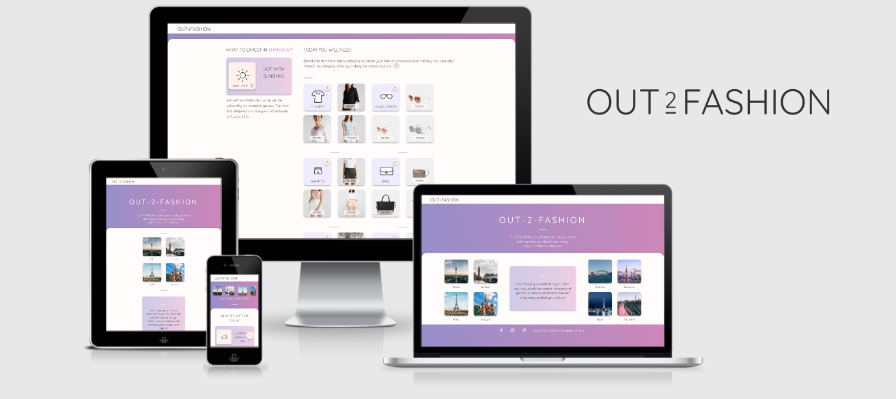

# OUT2FASHION - Clothing App Using Weather API Data

Code Institute - Milestone Project 2 - Interactive Frontend Development

OUT2FASHION is a mobile-first one-page web application that helps women stay stylish every day based on the clothing items they might need according to the weather forecast. The primary purpose of this web app is to inform the users about the daily weather forecasts in a fun and interactive way and to serve as a guidance for shopping relevant clothing items for their outfit of the day - buy what you like but also what you need! The secondary purpose is to give fashion brands an additional chance to market their products by every-day brand exposure in hope of increasing the sales.

The overall goal of the app is to turn a simple daily repetitive act of checking weather forecast to plan out the outfit of the day into a fun experience. Besides the weather forecast, the app informs the users about the new clothing products on the market which are only 1 click away.

## UX

A few months ago I've dived into the online shopping behaviour in fashion and apparel industry. I've found several interesting studies and research that helped me understand the user journey and motives of online fashion shoppers. Here are a few facts I've decided to highlight.

Recent research shows that [1 out of 5 buyers](https://www.oliverwyman.com/content/dam/oliver-wyman/v2/publications/2018/july/Oliver%20Wyman_Understanding%20Behavior%20of%20Apparel%20Shopper.pdf) choose to shop online for clothes while 78% of these online shoppers shop exclusively online. It might not seem as a big number but this is because the study has been done on a sample of buyers belonging to all age groups from 18 to 56+. These frequent online fashion shoppers tend to be younger in age - people in their late twenties and early thirties. This leaves us with young working adults who are either starting their careers or already upgrading their financial status by work promotions.

In addition, according to another research, [online apparel retail customers](https://www.retailcustomerexperience.com/blogs/examining-the-online-apparel-retail-customer-experience/) spend 30 minutes to an hour browsing. Those who spend more time doing so are likely to result in a purchase in order to avoid wasted efforts. I found this very insightful and it reminded me of the sunk cost fallacy, a key concept in behavioral economics. It made me wonder if this is also the reason why, as Shopify states, [the average return rate in e-commerce is 20%](https://www.shopify.com/enterprise/ecommerce-returns) causing the return reasons such as "changed my mind" in apparel industry.

Due to the fact that the higher basket value reduces or eliminates the shipping costs, I wasn't very surprised to read that [on average, apparel shoppers purchase up to three items in one sitting](https://www.retailcustomerexperience.com/blogs/examining-the-online-apparel-retail-customer-experience/). However, it did make me realise the importance of a wide selection of products, product categories and price ranges to encourage the full-basket checkouts.

The last super interesting information I've come across in two different reports is the fact that up to 90% of apparel shoppers are repeat buyers (accordiing to [Oliver Wyman](https://www.oliverwyman.com/our-expertise/insights/2018/jan/understanding-the-2017-apparel-shopper-journey.html) and [Stitch Fix](https://www.wired.com/story/stitch-fix-shop-your-looks/)). While Stitch Fix decided to benefit from this behaviour by personalising recommendations of 1000+ brands, I see this as an opportunity for individual brands or a few brands with similar style to increase their sales. It's not uncommon for people to identify their style with an already existing brand. Mine would be in that case brands like [Esprit](https://www.esprit.com/) and [Tom Tailor](https://www.tom-tailor.com/).

### Conclusion of the Research

Having abovementioned (and many other) facts in mind that I've found, I've decided to build a mobile web app that gives a meaningful purpose to fashion and apparel shopping. OUT2FASHION helps you pick out of your closet clothes that you really need for this particular day based on the weather forecast but it also gives you inspirational, shoppable suggestions of what is currently new on the market so that you can stay trendy all year long.

### Business Goals

As an online apparel brand owner...

* I want my brand to be exposed to the users every day, not only when they need to shop for something so that I have more chances for selling
* I want my customers to make better shopping decisions so that the return rate gets reduced because shipping costs me
* I want the users to have a choice in products so that they can fill their baskets and I save on shipping costs
* I want that my digital product adds value to the daily life of my customers so that my brand is associated with more than just clothes
* I want to offer a shopping journey to my customers that is fun and informative so that they have great user experience
* I want the customers to have an interface they love so that they will want to come back
* I want my customer to shop online so that I can save money on having less staff in my physical stores

### Customer Goals

As a customer...

* I want help with dressing up for the current weather forecast so that I can save time in the morning
* I want to stay trendy and stylish so that I can feel my best
* I want to have a choice when deciding what to buy so that I’m sure the selected products fit my style
* I want to know the prices so that I can see if the clothing items fit my budget
* I want to make online purchase so that I can save time by not having to go out to the store whenever I like something
* I want to know that my purchase is an informed decision so that I can feel my money has been spent well
* I want to feel good during the shopping journey and checkout so that I have fun while buying clothes

## Features and App Sections

As a first step, I've put together all the goals mentioned above and checked where they overlap.

Then I grouped them into Information and Features category. The Information category is a group of goals that can be easily solved by simply including the relevant information in the app. The Features are goals that I've decided to solve in a more fun and interesting way. This process helped me create the concept and the MVP of the OUT2FASHION mobile web app.

### App Sections

1. **Top navigation bar** - fixed on the top so that the users are able to navigate themselves back to the homepage anytime.
1. **Header** - introduction to the website. Once the user clicks on a city below the header, the header content changes to horizontal scrolling menu so that the users can access other cities' weather data once the homepage city shortcuts are gone.
1. **Main section - Homepage** - provides 8 cities for the users to choose from and an additional information on how the app works.
1. **City section** - gives the user information about the weather forecast for the selected city, which clothing items they will need based on the weather and temperature as well as contributes with the suggestions of the shoppable products from the product category.
1. **Footer** - gives users the option to stay up to date with the app via links to social media profiles.

### Features

Credits:
- https://loading.io/ - loader
- https://unsplash.com/ - images
- https://www.esprit.de/damenmode - products
- https://cssgradient.io/ - css code for gradient colours
- https://stackoverflow.com/questions/39884260/is-it-possible-to-set-horizontal-gradient-to-text-via-css-left-letter-one-colo - gradient left to right css code
- https://www.taniarascia.com/how-to-connect-to-an-api-with-javascript/ - helped me understand API connection better
- http://ami.responsivedesign.is/ - for the showcase photos and responsiveness look and feel
- https://esprima.org/demo/validate.html - for the help with small, often overlooked, JS syntax errors
- https://stackoverflow.com/questions/1144805/scroll-to-the-top-of-the-page-using-javascript - for the js code for scrolling to the top
- https://jsonformatter.curiousconcept.com/ - for the help with turning messy API code into readable and structure objects
- https://stackoverflow.com/questions/5265202/do-you-need-text-javascript-specified-in-your-script-tags - for an interesting read about why there's no need for type="text/javascript"
- http://jsfiddle.net/wSfJd/ - for help with creating horizontal scrolling menu in the city content header
