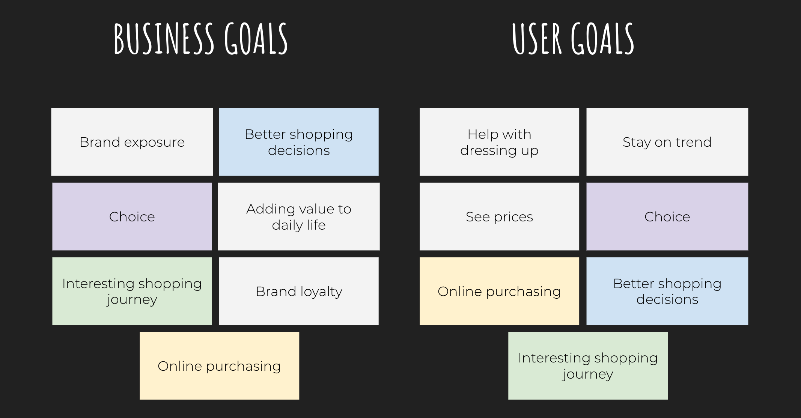
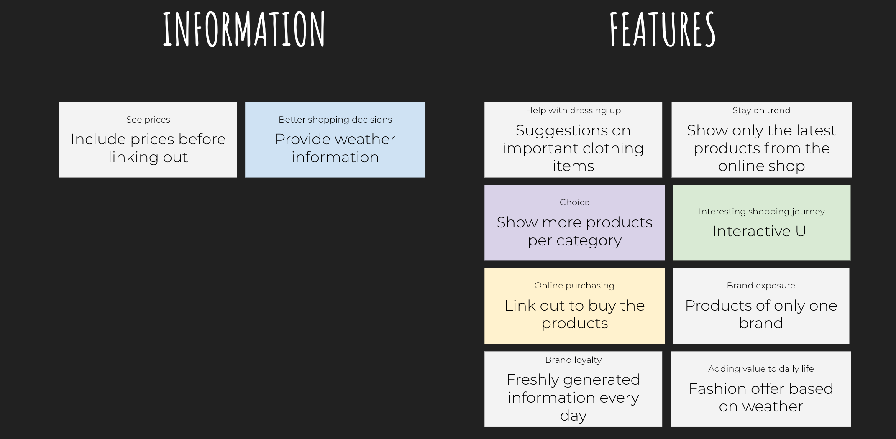
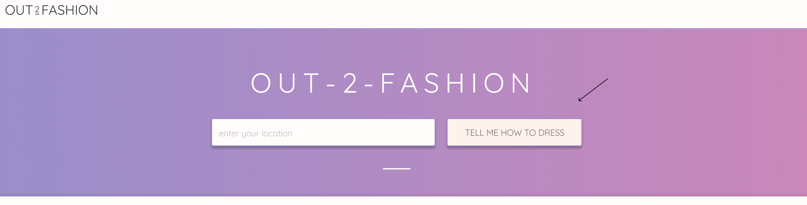
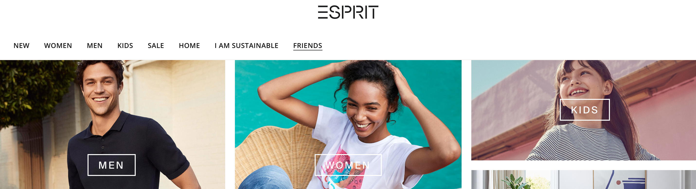
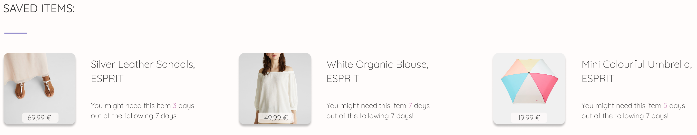
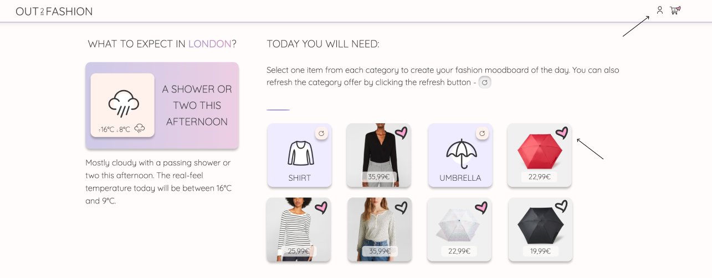
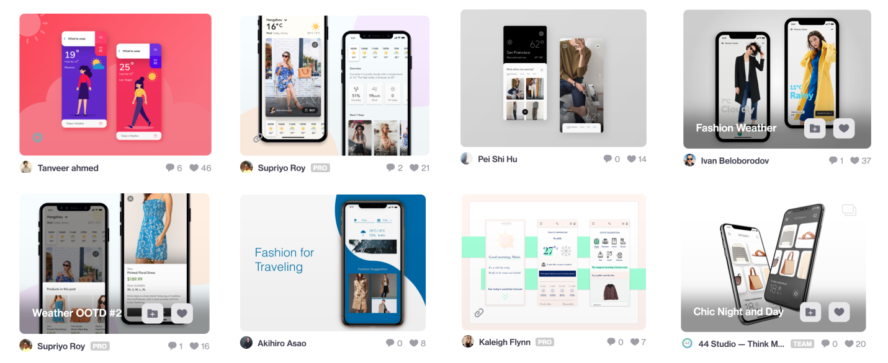
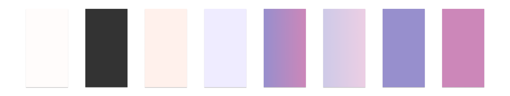

# OUT2FASHION - Clothing App Using Weather API Data

Code Institute - Milestone Project 2 - Interactive Frontend Development

OUT2FASHION is a mobile-first one-page web application that helps women stay stylish every day based on the clothing items they might need according to the weather forecast. The primary purpose of this web app is to inform the users about the daily weather forecasts in a fun and interactive way and to serve as a guidance for shopping relevant clothing items for their outfit of the day - buy what you like but also what you need! The secondary purpose is to give fashion brands an additional chance to market their products by every-day brand exposure in hope of increasing the sales.

The overall goal of the app is to turn a simple daily repetitive act of checking weather forecast to plan out the outfit of the day into a fun experience. Besides the weather forecast, the app informs the users about the new clothing products on the market which are only 1 click away.

## UX

A few months ago I've dived into the online shopping behaviour in fashion and apparel industry. I've found several interesting studies and research that helped me understand the user journey and motives of online fashion shoppers. Here are a few facts I've decided to highlight.

Recent research shows that [1 out of 5 buyers](https://www.oliverwyman.com/content/dam/oliver-wyman/v2/publications/2018/july/Oliver%20Wyman_Understanding%20Behavior%20of%20Apparel%20Shopper.pdf) choose to shop online for clothes while 78% of these online shoppers shop exclusively online. It might not seem as a big number but this is because the study has been done on a sample of buyers belonging to all age groups from 18 to 56+. These frequent online fashion shoppers tend to be younger in age - people in their late twenties and early thirties. This leaves us with young working adults who are either starting their careers or already upgrading their financial status by work promotions.

In addition, according to another research, [online apparel retail customers](https://www.retailcustomerexperience.com/blogs/examining-the-online-apparel-retail-customer-experience/) spend 30 minutes to an hour browsing. Those who spend more time doing so are likely to result in a purchase in order to avoid wasted efforts. I found this very insightful and it reminded me of the sunk cost fallacy, a key concept in behavioral economics. It made me wonder if this is also the reason why, as Shopify states, [the average return rate in e-commerce is 20%](https://www.shopify.com/enterprise/ecommerce-returns) causing the return reasons such as "changed my mind" in apparel industry.

Due to the fact that the higher basket value reduces or eliminates the shipping costs, I wasn't very surprised to read that [on average, apparel shoppers purchase up to three items in one sitting](https://www.retailcustomerexperience.com/blogs/examining-the-online-apparel-retail-customer-experience/). However, it did make me realise the importance of a wide selection of products, product categories and price ranges to encourage the full-basket checkouts.

The last fascinating information I've come across in two different reports is the fact that up to 90% of apparel shoppers are repeat buyers (according to [Oliver Wyman](https://www.oliverwyman.com/our-expertise/insights/2018/jan/understanding-the-2017-apparel-shopper-journey.html) and [Stitch Fix](https://www.wired.com/story/stitch-fix-shop-your-looks/)). While Stitch Fix decided to benefit from this behaviour by personalising recommendations of 1000+ brands, I see this as an opportunity for individual brands or a few brands with similar style to increase their sales. It's not uncommon for people to identify their style with an already existing brand. Mine would be in that case brands like [Esprit](https://www.esprit.com/) and [Tom Tailor](https://www.tom-tailor.com/).

### Conclusion of the Research

Having above mentioned (and many other) facts in mind that I've found, I've decided to build a mobile web app that gives a meaningful purpose to fashion and apparel shopping. OUT2FASHION helps you pick out of your closet clothes that you really need for this particular day based on the weather forecast but it also gives you inspirational, shoppable suggestions of what is currently new on the market so that you can stay trendy all year long.

### Business Goals

As an online apparel brand owner...

* I want my brand to be exposed to the users every day, not only when they need to shop for something so that I have more chances for selling
* I want my customers to make better shopping decisions so that the return rate gets reduced because shipping costs me
* I want the users to have a choice in products so that they can fill their baskets and I save on shipping costs
* I want that my digital product adds value to the daily life of my customers so that my brand is associated with more than just clothes
* I want to offer a shopping journey to my customers that is fun and informative so that they have great user experience
* I want the customers to have an interface they love so that they will want to come back
* I want my customer to shop online so that I can save money on having less staff in my physical stores

### Customer Goals

As a customer...

* I want help with dressing up for the current weather forecast so that I can save time in the morning
* I want to stay trendy and stylish so that I can feel my best
* I want to have a choice when deciding what to buy so that I’m sure the selected products fit my style
* I want to know the prices so that I can see if the clothing items fit my budget
* I want to make online purchase so that I can save time by not having to go out to the store whenever I like something
* I want to know that my purchase is an informed decision so that I can feel my money has been spent well
* I want to feel good during the shopping journey and checkout so that I have fun while buying clothes

## Features and App Sections

As a first step, I've put together all the goals mentioned above and checked where they overlap.

Then I grouped them into Information and Features category. The Information category is a group of goals that can be easily solved by simply including the relevant information in the app. The Features are goals that I've decided to solve in a more fun and interesting way. This process helped me create the concept and the MVP of the OUT2FASHION mobile web app.

### App Sections

1. **Top navigation bar** - fixed on the top so that the users are able to navigate themselves back to the homepage anytime.
1. **Header** - introduction to the website. Once the user clicks on a city below the header, the header content changes to horizontal scrolling menu so that the users can access other cities' weather data once the homepage city shortcuts are gone.
1. **Main section - Homepage** - provides 8 cities for the users to choose from and an additional information on how the app works.
1. **City section** - gives the user information about the weather forecast for the selected city, which clothing items they will need based on the weather and temperature as well as contributes with the suggestions of the shoppable products from the product category.
1. **Footer** - gives users the option to stay up to date with the app via links to social media profiles.

### Features

1. **City selection** - a feature that generates new content based on the city of the user's choice. There are 8 cities to choose from.
1. **Weather forecast summary** - a visual and textual presentation of the weather forecast based on the API weather information fetched from [AccuWeather](https://www.accuweather.com/).
1. **Product categories** - based on the forecast, the app generates 7 clothing items the user should keep in mind while choosing the outfit for the day.
1. **Display products** - each clothing item has a preview of 3 suggested products from that category that the user can buy if they want.
1. **Refresh products** - if the user is particularly interested in seeing more products from a certain product category, they can click the refresh button at the top of the product category icon to load more products.
1. **Scroll to the top** - a button on mobile devices that brings the user back to the top of the page. This is especially handy when the user is already reading one city weather suggestion but want to switch to another one.
1. **Interactive navigation in the header** - once the user is in the city section, they can access other cities from an interactive, horizontal scrollable gallery in the header. As this is a one-page web app, the return button will not work so this feature is quite handy in this sense.
1. **New information everyday** - the app refreshes the weather data every day which as a consequence generates new product selection for the users.
1. **Link outs to the web shops** - serves as a quick solution for the users that want to check out in detail or buy some of the products.
1. **Social media profiles' links** - allow users to stay up to date with the latest news about the app.

### Features Left to Implement

1. **Search function** - even though it was originally planned and the [API documentation of AccuWeather](https://apidev.accuweather.com/developers/auto-complete) supports it (check the wireframes and first commits), I couldn't make the search function for the locations work even after trying several times and had to leave this feature out in order to build and improve the other ones due to lack of time.

2. **Pick your gender before entering the app** - I would love this app to be able to reach broader audience and not be focused only on women. Example taken from [Esprit](https://www.esprit.com/index.php?country_code=GB&lang=en).

3. **Weather forecast for more than 1 day** - at the moment one of the main goals of the app is to be used every day so that the chances of buying something and being constantly exposed to products is maximised. The user is 'forced' to return to the app every day in order to check the weather. In the long run, I would implement a weekly forecast so that the users can plan their shopping activities better. Moreover, it would be helpful if they could get a predicted likelihood of some kind for the saved items. For example, a saved umbrella item or umbrella in the shopping basket could have a small note like - _You might need this item 5 days out of the following 7 days!_

4. **Shopping through the UI** - instead of link outs, the app would be ideally connected to the online store (in case the products are only from one brand) or multiple web shops (in case the products from different brands). This way the user could put everything in a basket of OUT2FASHION and check out directly from the app. The app would then order the products from original shops. Additionally, the user could also create an account where they could save products for later.

5. **Better content transition and more animations** - ideally I would like to implement a better content transition from the homepage to the API generated content. At the moment it seems that when the user clicks on a city, there's a new page loaded - which is not the case. The homepage content could for example slide down and the generated content could slide up. Additionally, I was also planning to make the refresh button turn 360 degrees before the product selection gets refreshed as well as make the products shake a little before they change.

6. **Fashion API connection** - currently, the user can refresh the product category only 5 times before they start seeing the same products again. I've been searching for a free fashion/apparel API that would fit the requirements of the project but I haven't been successful at it. In case this project wouldn't be for one brand only, my plan for the future of the product would be to register as an affiliate publisher, connect to fashion brands APIs and earn from the commissions.

### Wireframes

As I was planning to implement the search function originally, the following low-fidelity wireframes are a bit different than what I have built. Eventually I had to remove the search box and add text in the header, as well as the visual navigation gallery. The homepage had additional content giving the sneak-peak into the product's feature but that was removed in order to make space for more cities as a backup plan due to the search box removal.

The wireframes are available at the following links:

Desktop:
* [Desktop homepage wireframe](https://github.com/valentina-b/out2fashion-weather-clothing-app/blob/master/readme-files/wireframes/img-wireframe-dsk-hp.png?raw=true)
* [Desktop city wireframe](https://github.com/valentina-b/out2fashion-weather-clothing-app/blob/master/readme-files/wireframes/img-wireframe-dsk-city.png?raw=true)

Tablet:
* [Tablet homepage wireframe](https://github.com/valentina-b/out2fashion-weather-clothing-app/blob/master/readme-files/wireframes/img-wireframe-tab-hp.png?raw=true)
* [Tablet city wireframe](https://github.com/valentina-b/out2fashion-weather-clothing-app/blob/master/readme-files/wireframes/img-wireframe-tab-city.png?raw=true)

Mobile:
* [Mobile homepage wireframe](https://github.com/valentina-b/out2fashion-weather-clothing-app/blob/master/readme-files/wireframes/img-wireframe-mob-hp.png?raw=true)
* [Mobile city wireframe](https://github.com/valentina-b/out2fashion-weather-clothing-app/blob/master/readme-files/wireframes/img-wireframe-mob-city.png?raw=true)

## Graphic Design and Brand Elements

OUT2FASHION is not imagined as a random fashion marketplace. It is a mobile web app combining a daily activity of checking the weather forecast and apparel industry. It strives to be a unique, informative and fun weather app but it also gives a meaningful purpose to buying clothes. Its vision is to function well both for the users and brand owners. At the same time, the MVP is currently only for women, targeting late twenties and early thirties age groups. My goal was to create a pleasant, feminine look that would also fit the imagery of the clothing brand I've previously selected based on my personal affinity, [Esprit](https://www.esprit.com/).

Therefore, I wanted to focus on modern app designs which are fashion and/or weather related - not online clothing shops, high-fashion brands or weather sites. My biggest source of inspiration was [Dribbble](https://dribbble.com/) where I went through designs of people who had a similar product idea like mine. My goal was also to achieve modern app look which I'll explain more in the next sections.

The following design ideas had the biggest impact on my design decisions:

### Fonts

I have come across [Quicksand](https://fonts.google.com/specimen/Quicksand) by browsing through Google fonts. I was looking for fonts that are similar to Roboto, Raleway and Montserrat as I personally consider them modern and easy to read - which is exactly what I wanted to achieve with my font selection as well. I've noticed that Quicksand is often paired with all of these three fonts and decided to keep it.

### Colours

My colour selection consists of light colours for the background of the content and icons. The font is in the darker shade of gray to make the reading more pleasant to the eyes. As gradient colours are quite popular among apps, I've decided to create one for OUT2FASHION as well, in order to stay up to date with the look-and feel. Lastly, I've taken both end shades of the gradient spectrum to use them for any other elements that might need some accent, like lines and hover effects.

### Visual Style

Once the font, colour palette and source of imagery was selected, I've focused on the design of the elements. The elements of the app tend to follow standard modern app look which is based on shadows and round edges.

The lines between the content sections are there to create short breaks while being exposed to so many product images.

## Technologies Used

This project greatly focuses on the following technologies:

1. [HTML](https://en.wikipedia.org/wiki/HTML) - for creating the layout and the structure of the website
1. [CSS](https://en.wikipedia.org/wiki/Cascading_Style_Sheets) - for styling the website’s HTML code
1. [Bootstrap](https://getbootstrap.com/) - for additional styling and adding responsiveness to the website
1. [JavaScript](https://en.wikipedia.org/wiki/Cascading_Style_Sheets) - for adding functionalities behind the elements, fetching API data and general logic of the app
1. [jQuery](https://jquery.com/) - for faster coding and practising when I felt comfortable, mostly for DOM and class manipulation
1. [Git](https://git-scm.com/) - for version control

Technology used that is connected to [Bootstrap](https://getbootstrap.com/) for some components to function properly:

1. [jQuery](https://jquery.com/)
1. [Popper.js](https://popper.js.org/)
1. [Javascript](https://en.wikipedia.org/wiki/JavaScript)

Additionally, I have also used the following platforms to help me shape the website and the brand:

1. [Gitpod](https://gitpod.io/) - for writing, editing and live previewing the code during the creation process
1. [GitHub](https://github.com/) - for hosting the project's repository and creating a preview link on GitHug pages
1. [TinyPNG](https://tinypng.com/) - for compressing the images so that the website can load faster
1. [Google Fonts](https://fonts.google.com/) - for selecting the fonts and implementing them into the HTML code
1. [Figma](https://www.figma.com/) - for creating wireframes and designs
1. [CSS Gradient](https://cssgradient.io/) - for the help with creating the css code for gradient colours
1. [JSON Formatter](https://jsonformatter.curiousconcept.com/) - for the help with turning messy API code into readable and structured objects
1. [AccuWeather API](https://developer.accuweather.com/) - for getting the weather forecast data

## Testing

The project's code was frequently validated through:
* [W3 HTML validator](https://validator.w3.org/nu/)
* [W3 CSS validator](http://www.css-validator.org/)
* [Esprima JS validator](https://esprima.org/demo/validate.html)

The web app was tested on the devices and browsers listed below. I loaded the page on each of the device and browser combination and looked for any visual and functional errors. I've also tried to resize browsers on desktop to look for hidden irregularities. More about the errors I've encountered can be found under the 'Bugs and Problems'.

Desktop:

1. Acer
  * Google Chrome
  * Internet Explorer
  * Firefox
2. MacBook
  * Google Chrome
  * Safari
  * Opera
  * Firefox

Mobile:

1. iPhone 8
  * Safari
2. HTC
  * Google Chrome

### Testing the Features

* City selection
  1. Load the homepage
  1. Click on one out of eight city images
  1. The feature works if you have now reached the page which displayed weather data and product offer

* Weather forecast summary
  1. Load the homepage
  1. Click on one out of eight city images
  1. Check if the weather section populated with weather icons, temperatures and additional phrases
  1. Check if the text below the weather section loaded as well
  1. In case something went wrong, you will see smiley faces instead of the icons and 0 degrees for temperatures

* Product categories
  1. Load the homepage
  1. Click on one out of eight city images
  1. Check if the seven product categories loaded
  1. In case something went wrong, you will see smiley faces instead of product icons

* Display products
  1. Load the homepage
  1. Click on one out of eight city images
  1. Check if the seven product categories loaded
  1. Check if the product offer loaded and matches the product category
  1. In case something went wrong, you will see a placeholder product photo instead of product images

* Refresh products
  1. Load the homepage
  1. Click on one out of eight city images
  1. Check if the seven product categories loaded
  1. Check if the product offer loaded and matches the product category
  1. Click the refresh button (round arrow) in the top right corner of one of the seven product categories
  1. The feature works if the product offer loaded 3 new products from that product category

* Scroll to the top
  1. Load the web app on a mobile device with a width smaller than 768px
  1. Stay on the homepage or click on a city
  1. Scroll further down the page and click on the scroll up button placed in the bottom right corner of the screen
  1. The feature works if you have reached the top of the page

* Interactive navigation in the header
  1. Load the homepage
  1. Click on one out of eight city images
  1. Notice the navigation gallery in the header and place your cursor or finger on it
  1. Scroll or swipe left and right
  1. Click on one of the cities
  1. The feature works if you were able to scroll or swipe left and right and there was new content generated for the city you've clicked on

* New information everyday
  1. Load the homepage the next day
  1. Click on one out of eight city images
  1. The feature works if you can see new weather data and product categories based on that weather information

* Link outs to the web shops
  1. Load the homepage
  1. Click on one out of eight city images
  1. Check if the seven product categories loaded
  1. Check if the product offer loaded and matches the product category
  1. Click on one of the products
  1. If a new tab linked to that product opened, the feature works as planned

* Social media profiles' links
  1. Load the homepage and click on one out of eight city images if you want
  1. Scroll to the footer
  1. Look for the social media icons (Facebook, Instagram and Pinterest)
  1. Click on one of the icons
  1. The feature works if a new tab opened linked to that social media platform

### Bugs and Problems

[W3 HTML validator](https://validator.w3.org/nu/) helped me discover duplications in `id` attributes which happened due to lots of copy/pasting the code while [W3 CSS validator](http://www.css-validator.org/) came back with successful results. A huge help was the [Esprima JS validator](https://esprima.org/demo/validate.html) which I've used often throughout the project. It helped me discover early on missed or additional brackets.

The following cross-browser issues and other bugs **haven't been fixed yet** due to lack of knowledge or lack of time.

Discovered cross-browser issues:

* smooth scrolling (`window.scrollTo({ top: 0, behavior: 'smooth' });`) doesn't work in Internet Explorer and Safari
* footer elements are left-aligned instead of being centered in responsive forms in Internet Explorer and Firefox
* tablet responsiveness of the homepage in Firefox and Internet Explorer is not working, it just stocks city images on top of each other
* tablet responsiveness of the city content in Firefox and Internet Explorer pushes almost all content to the left

Discovered bugs:

* Scroll to the top and City selection features don't work in Internet Explorer, not even the hover effects work - which basically means the user can only access the homepage. I am suspecting there might be incompatibilities between the browser and jQuery.
* when the user clicks on one of the cities, it might take some time to load the data and all the images. The app first loads the html with its placeholder icons and images and then changes them. The user might notice this content change. I could have removed the placeholders but I've decided to keep them because the API key has only 50 free calls per day. I wanted the app to still be populated with content if the limit has been reached.
* when the user clicks on the refresh button, it sometimes might happen the products don't load on the first click. I'm not completely sure why is that and it happens more often on the mobile devices than on desktop. If the user clicks the second time, then it often happens the product selection refreshes twice very quickly. However, it also appears that the more the app is used, the less likely this is to happen.
* the hover effects placed on the refresh button and cities stay on mobile devices after the user clicks on them. They disappear once the user clicks on some other element on the page. I've tried to solve this by [.off() jQuery method](https://api.jquery.com/off/) because I was suspecting it should help but I wasn't successful.

Other important remarks:

* this project has 50 free API calls per day. The number is refreshed around 2.30 pm CET time. This might cause the visitor to be left out of API calls and the app won't be able to fully complete its purpose. If that happens, please check OUT2FASHION the next day afternoon again.
* the products on the page are a result of my manual work. I manually had to download each product image (all 240 of them) and write down the price in the product.js file, along with the copied link. I've already caught some of the mistakes and corrected them - hopefully there are none anymore. However - it is very likely to happen in the next weeks or even days that the products will be out of stock or completely removed from the offer due to season change. If you link out and the link is broken, it's probably for that reason because I did do an extensive link check for each product category.
* as a result of having a mini hard-coded "product API", the user can refresh the products only 5 times before they start seeing the same products within the category again.
* during my mentoring session, I expressed my concerns about having lots of repetitive javascript code. I am aware that some functions could have been written in a shorter way and would definitely approach the project differently the next time. As for now, my mentor was glad to hear I've been able to notice the areas of improvement and kindly explained to me that the duplication is mostly coming from lack of knowledge about data structures and that some things could have been differently done. He also gave me advices on how to get that knowledge and how to reach the point of understanding the topic better. Nevertheless, at this point I'm very happy with my progress so far and look forward to expanding my knowledge even further!

## Deployment

### GitHub Pages

To deploy a website on GitHub Pages, follow these steps:

1. Go to the repository page
1. Click on settings icon in the top of the page
1. Find "GitHub Pages" section
1. Click on the "Source" dropdown menu
1. Select "master branch" option
1. A green success message should appear in the "GitHub Pages" section with the link to the live preview of the project.

For more information please visit [here.](https://help.github.com/en/github/working-with-github-pages/configuring-a-publishing-source-for-your-github-pages-site)

### Local Deployment

To create a local copy of a repository, follow these steps:

1. Go to the repository page
1. Click on the "Clone or download" button in the top of the page
1. Click the check list icon on the right of the newly opened window to clone the repository using HTTPS
1. Open Terminal
1. Change the current working directory to the location where you want the cloned directory to be made
1. Type "git clone" and paste the URL you copied in step 3 and run the command

For more information please visit [here.](https://help.github.com/en/github/creating-cloning-and-archiving-repositories/cloning-a-repository)

## Credits

### Content

* Besides the textual content coming from the [AccuWeather](https://www.accuweather.com/), the content for this web app is completely original, written by me.

### Media

* The city photos on the website are taken from [Unsplash](https://unsplash.com/).
* The products and the prices are taken from [Esprit](https://www.esprit.com/) - they completely own the rights for them. I did my best to make sure the prices and the links to the products are correctly matched.
* Icons are downloaded from [Flaticon](https://www.flaticon.com/). They were made by [Pixel perfect](https://www.flaticon.com/authors/pixel-perfect), [Freepik](https://www.flaticon.com/authors/freepik), [Lyolya](https://www.flaticon.com/authors/lyolya), [Becris](https://www.flaticon.com/authors/becris) and [Vitaly Gorbachev](https://www.flaticon.com/authors/vitaly-gorbachev).
* The product showcase image was taken with the help of [Ami.ResponsiveDesign](http://ami.responsivedesign.is/).
* I've also went through design projects on [Dribbble](https://dribbble.com/) to get inspired about the app layout.

### Coding Sources

* Helped me understand and use [Horizontal gradient text effect](https://stackoverflow.com/questions/39884260/is-it-possible-to-set-horizontal-gradient-to-text-via-css-left-letter-one-colo).
* Helped me understand [API connection](https://www.taniarascia.com/how-to-connect-to-an-api-with-javascript/) better.
* Helped create the [Scroll to the top button](https://stackoverflow.com/questions/1144805/scroll-to-the-top-of-the-page-using-javascript).
* Helped me understand [Why there's no need for type="text/javascript" in html file](https://stackoverflow.com/questions/5265202/do-you-need-text-javascript-specified-in-your-script-tags).
* Helped me create [The horizontal scrolling menu](http://jsfiddle.net/wSfJd/).

### Acknowledgments

* A huge and warm thank you to my mentor [Dick Vlaanderen](https://github.com/dickvla) who was an enormous source of encouragement, helpful advices and guidance throughout this project - your kind words meant so much more than you can imagine!
* Thank you [CodeInstitute's](https://codeinstitute.net/) Slack community for being there for annoying little bug questions!

